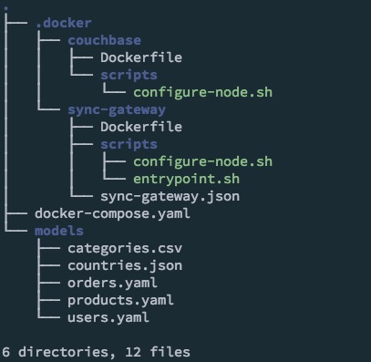
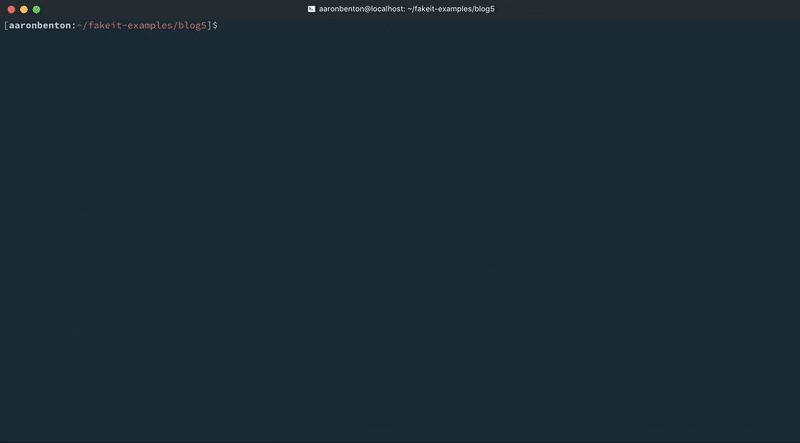
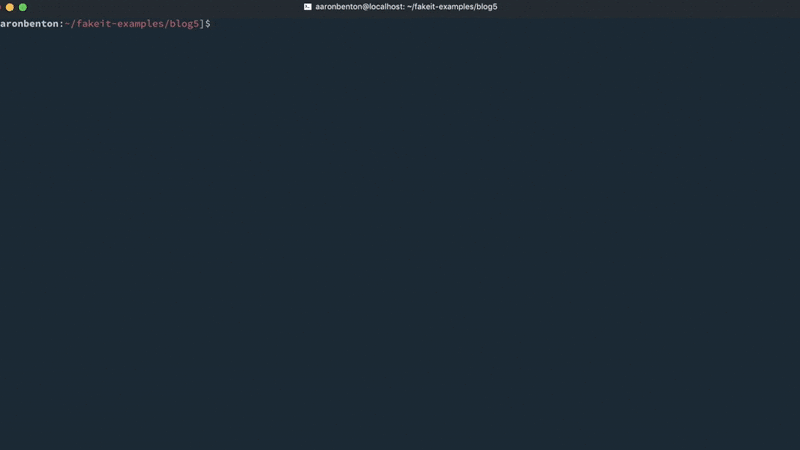
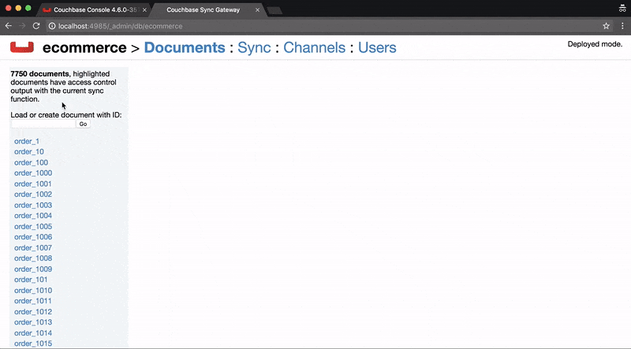

# FakeIt Series 5 of 5: Rapid Mobile Development w/ Sync-Gateway

For our last post in the [FakeIt](https://github.com/bentonam/fakeit) series we are going to explore how we can leverage [FakeIt](https://github.com/bentonam/fakeit) + [Couchbase Server](https://www.couchbase.com/nosql-databases/couchbase-server) + [Sync Gateway](https://www.couchbase.com/nosql-databases/couchbase-mobile) to get our local environment up and running for mobile development.  We will be doing this by using [Docker](https://www.docker.com/) and [docker-compose](https://docs.docker.com/compose/). *Disclaimer: I am by no means a Docker expert, this is simply an example of what I've done to quickly setup a development environment and dataset.*

### Docker 

We will be using two Docker Containers, one for [Couchbase Server](https://www.couchbase.com/nosql-databases/couchbase-server) and one for [Sync Gateway](https://www.couchbase.com/nosql-databases/couchbase-mobile).  We could define a `docker-compose.yaml` file that simply pulled from `couchbase:latest` and `couchbase/sync-gateway:latest` but there would still be a need for manual configuration and we want to be able to automate as much as possible for our application.  To do that we will need to build our own containers from both of these adding our own scripts and configuration.  

##### ./docker-compose.yaml

```yaml
version: '2'
services:
  fakeit-couchbase:
    build:
      context: ./.docker/couchbase/
    container_name: fakeit-couchbase
    ports:
      - "8091-8094:8091-8094"
      - "11210:11210"
    volumes:
      - ./:/app
  fakeit-syncgatway:
    build:
      context: ./.docker/sync-gateway/
    container_name: fakeit-syncgateway
    depends_on:
      - fakeit-couchbase
    ports:
      - "4984-4985:4984-4985"
    volumes:
      - ./:/app
```

Our `docker-compose.yaml` file is first building a container in the Dockerfile from `./.docker/couchbase/Dockerfile` which looks like this.

##### ./.docker/couchbase/Dockerfile

```Dockerfile
# start with couchbase
FROM couchbase:latest

# copy the configure script
COPY scripts/configure-node.sh /opt/couchbase

# execute the configure-node.sh script 
CMD ["/opt/couchbase/configure-node.sh"]
```

This `Dockerfile` is really only doing two things, copying a configuration script and executing that script.  The `configure-node.sh` script looks like this. 

##### ./.docker/couchbase/scripts/configure-node.sh

```bash
set -m

/entrypoint.sh couchbase-server &

echo 'Waiting 20 seconds for Couchbase service to start'
sleep 20

# configure the cluster
echo 'Configuring Cluster'
/opt/couchbase/bin/couchbase-cli cluster-init -c localhost:8091 --cluster-username=Administrator --cluster-password=password --cluster-port=8091 --cluster-ramsize=500 --service=data

# create the ecommerce bucket
echo 'Creating ecommerce bucket'
/opt/couchbase/bin/couchbase-cli bucket-create -c localhost:8091 -u Administrator -p password --bucket=ecommerce --bucket-eviction-policy=fullEviction --bucket-type=membase --bucket-priority=high --enable-index-replica=0 --bucket-port=11211 --enable-flush=1 --bucket-replica=1 --bucket-ramsize=200

echo 'Couchbase server is ready'

fg 1
```

The `configure-node.sh` script is doing a couple of things: 

1. Waiting for the Couchbase service to start so it can be configured
2. Initializing the Cluster configuration
3. Creating our `ecommerce` bucket

The Couchbase container is now built, the next container that needs to be built is the Sync Gateway container.  By default the Sync Gateway container uses the `walrus` memory only sync gateway bucket.  We will need to update this configuration by providing our own `sync-gateway.json` file so we can update the storage and access settings.  Lastly, the Sync Gateway container only exposes port 4984, which is the public port, as this is for development purposes we will go ahead and expose port 4985 which is the administrator port.  

##### ./.docker/sync-gateway/Dockerfile

```Dockerfile
# Start with the base sync gateway
FROM couchbase/sync-gateway:latest

# Copy the sync-gateway.json into the container
COPY sync-gateway.json /opt/sync_gateway/sync-gateway.json

# Create Volume for data to persist
RUN mkdir -p /opt/sync_gateway/data

# Copy Entry Point
COPY scripts/entrypoint.sh /
ENTRYPOINT ["/entrypoint.sh"]

# Copy the configure script
COPY scripts/configure-node.sh /opt/sync_gateway

# Configure the Sync Gateway and Start it
CMD ["/opt/sync_gateway/configure-node.sh"]

#  port 4984: public port
#  port 4985: admin port
EXPOSE 4984 4985
```

##### ./.docker/sync-gateway/sync-gateway.json

```json
{
  "interface": "0.0.0.0:4984",
  "adminInterface": "0.0.0.0:4985",
  "log": ["CRUD+", "REST+", "Changes+", "Attach+"],
  "CORS": {
    "Origin":["*"],
    "LoginOrigin":["*"],
    "Headers":["Content-Type"],
    "MaxAge": 1728000
  },
  "databases": {
    "ecommerce": {
      "server": "http://fakeit-couchbase:8091",
      "bucket": "ecommerce",
      "users": {
        "GUEST": {
          "disabled": false
        }
      },
      "sync": "function(doc, oldDoc) { channel(doc.channels); }"
    }
  }
}
```

##### ./.docker/sync-gateway/scripts/configure-node.sh

```bash
#!/bin/bash

set -m

echo 'Waiting 20 seconds for Couchbase service to start and warm up'

sleep 20

echo 'Starting the Sync Gateway Service'
/entrypoint.sh sync_gateway /opt/sync_gateway/sync-gateway.json

echo 'Couchbase Sync Gateway is ready'
```

Again, this is for development purposes only.  You should never allow access from anywhere to your `adminInterface` or enable **GUEST** access to your sync-gateway unless there is a very good reason to do so.

The structure of our app now looks like this: 



Now that we have configured out Docker containers and setup our docker-compose.yaml file we need to build and start the containers.  We do this by executing the following command from within our applications directory: 

```bash
docker-compose up -d
```
*Note:* for the purposes of the screencast, the `-d` parameter to run the containers in detached mode is omitted. 



### Models

Our containers are now started, the next thing we need to do before we generate our dataset is update the models to support the channels attribute.  

##### users.yaml

This model will only be synced to user specific channels. 

```yaml
name: Users
type: object
key: _id
data:
  min: 1000
  max: 2000
  inputs: ./countries.json
properties:
  _id:
    type: string
    description: The document id built by the prefix "user_" and the users id
    data:
      post_build: `user_${this.user_id}`
  channels:
    type: array
    data:
      post_build: |
        return [ `channel-user-${this.user_id}` ];
  doc_type:
    type: string
    description: The document type
    data:
      value: "user"
...
```

##### products.yaml

Just for fun we will publish this model to a global channel all of our users will be subscribed to.

```yaml
name: Products
type: object
key: _id
data:
  min: 500
  max: 1000
  inputs:
    - ./categories.csv
  pre_build: globals.current_category = faker.random.arrayElement(inputs.categories);
properties:
  _id:
    type: string
    description: The document id
    data:
      post_build: `product_${this.product_id}`
  channels:
    type: array
    data:
      build: |
        return [ `channel-products` ];
  doc_type:
    type: string
    description: The document type
    data:
      value: product
...
```

##### orders.yaml 

This model will only be synced to user specific channels.

```yaml
name: Orders
type: object
key: _id
data:
  dependencies:
    - products.yaml
    - users.yaml
  min: 5000
  max: 6000
properties:
  _id:
    type: string
    description: The document id
    data:
      post_build: `order_${this.order_id}`
  channels:
    type: array
    data:
      build: |
        return [ `channel-user-${this.user_id}` ];
  doc_type:
    type: string
    description: The document type
    data:
      value: "order"
...
```

Now that our models have been updated to support channels, we can generate our random dataset and push it into [Couchbase Server](https://www.couchbase.com/nosql-databases/couchbase-server) through the [Sync Gateway](https://www.couchbase.com/nosql-databases/couchbase-mobile) REST API.  We tell [FakeIt](https://github.com/bentonam/fakeit) to do this by using the following command: 

```bash
fakeit sync-gateway --server http://localhost:4984 --bucket ecommerce --verbose models/*
```

For development purposes we have allowed guest access to our [Sync Gateway](https://www.couchbase.com/nosql-databases/couchbase-mobile).  However, if you have guest access disabled, you can still use [FakeIt](https://github.com/bentonam/fakeit) by specifying a username and password to an existing user by using the following command: 

```bash
fakeit sync-gateway --server http://localhost:4984 --bucket ecommerce --username YOURUSERNAME --password YOURPASSWORD --verbose models/*
```

Before the generated dataset is output, [FakeIt](https://github.com/bentonam/fakeit) will authenticate against the [Sync Gateway](https://www.couchbase.com/nosql-databases/couchbase-mobile) to retrieve the necessary session information. 



### Testing

The next thing we need to do is to create a sync gateway user so that we can sync their documents locally.  For this test, we are going to grab a random user document from our Users model and create a user from that document.  In this example it will be `user_1001`, and we will create the user using the curl command:

```bash
curl --silent --show-error \
  -H "Content-Type: application/json; charset=UTF-8" \
  -H "Content-type: application/json" \
  -X PUT \
  -d '{"name":"Domenic81","password":"pgid_Tubn0qoEtZ","admin_channels":["channel-user-1001", "channel-products"]}' \
  'http://localhost:4985/ecommerce/_user/Domenic81'
```



### Conclusion

Throughout this series you've seen how [FakeIt](https://github.com/bentonam/fakeit) can take simple YAML models and generate vast amounts of fake data and send that data to multiple different destinations.  Please checkout the repository, pull requests are welcome, we are always looking for improvements and enhancements to make the tool more useful for the community.  I would also like to take this time to thank those who've made contributions to the project. The 1.0 version would not have been released without the help of  [Tyler Benton](https://github.com/tjbenton) ([@tjbenton21](https://twitter.com/tjbenton21)), also [Trevor Brindle](https://github.com/tabrindle) ([@VinceKerrazzi](https://twitter.com/VinceKerrazzi)), [Jessica Kennedy](https://github.com/mistersender) ([@mistersender](https://twitter.com/mistersender)), [Adam Burdette](https://github.com/alburdette619) ([@RavenStorms619](https://twitter.com/RavenStorms619)) and [Brant Burnett](https://github.com/brantburnett) ([@btburnett3](https://twitter.com/btburnett3)) 

#### Previous

- [FakeIt Series 1 of 5: Generating Fake Data](https://blog.couchbase.com/fakeit-series-generating-fake-data/)
- [FakeIt Series 2 of 5: Shared Data and Dependencies](https://blog.couchbase.com/fakeit-series-shared-data-dependencies/)
- [FakeIt Series 3 of 5: Lean Models through Definitions](https://blog.couchbase.com/fakeit-series-3-5-lean-models-through-definitions/)
- [FakeIt Series 4 of 5: Working with Existing Data](https://blog.couchbase.com/fakeit-series-working-existing-data/)